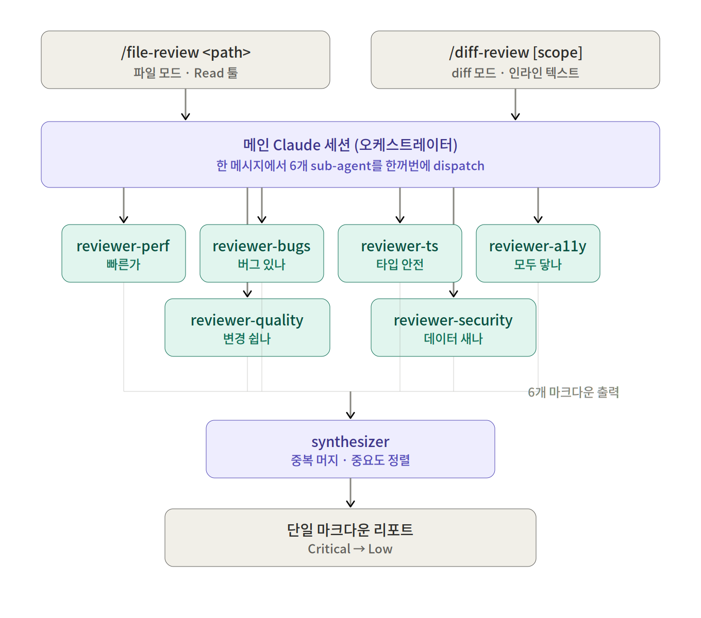

<p align="center">
  
</p>

<div align="center">

[](LICENSE)
[](#빠른-시작)

**N개의 프론트엔드 가이드라인이 같은 변경사항을 동시에 검토합니다.**

[빠른 시작](#빠른-시작) · [리뷰어](#리뷰어) · [왜 이렇게 설계했나](#왜-이렇게-설계했나) · [구조](#architecture) · [커스터마이징](docs/adding-a-reviewer.md)

한국어 · [English](./README.en.md)

</div>

Claude Code용 **멀티 코드 리뷰어 플러그인**. git diff 또는 단일 파일을 6가지 관점으로 리뷰합니다. 각 **리뷰어**는 단일 목적의 에이전트로, 다른 리뷰어들과 함께 병렬로 호출됩니다. synthesizer 에이전트가 6개 결과를 하나의 리포트로 합칩니다.

기본 관점은 '업계에서 검증된 프론트엔드 가이드라인'을 그대로 따릅니다. 직접 리뷰어를 추가하려면 에이전트 파일을 만들고 두 슬래시 커맨드에 등록하세요.

## 주요 특징

- **전문 리뷰어** — Vercel React Best Practices · Toss Frontend Fundamentals · Effective TypeScript · WCAG 2.2 · OWASP 스타일 프론트엔드 보안.
- **한 번에 동시 호출** — 6개 리뷰어가 하나의 어시스턴트 메시지에서 동시에 호출됩니다.
- **격리된 컨텍스트** — 각 리뷰어는 자체 sub-agent 컨텍스트에서 리뷰합니다. 관점 간 추론 오염 없음, mode collapse 없음.
- **두 진입점** — `/fe-review-agents:diff-review [scope]` (git diff), `/fe-review-agents:file-review <path>` (단일 파일 딥다이브).
- **간단한 설치** — Claude Code 마켓플레이스에서 두 줄. 추가 의존 없음.
- **언어 세팅** — `lang=ko` (기본) 또는 `lang=en`.
- **심각도 필터** — `severity_min=LOW` (기본), `MED`, `HIGH`, `CRITICAL`. 그 이하 심각도는 리포트에서 제외.

## 빠른 시작

### 설치

Claude Code 안에서 두 커멘드 순차 실행:

```
/plugin marketplace add huurray/fe-review-agents
/plugin install fe-review-agents@fe-review-agents
```

`/plugins` 로 활성화 상태 확인. 자동완성에 슬래시 커맨드가 바로 안 뜨면 `/reload-plugins` (또는 Claude Code 세션 재시작).
업데이트는 `/plugin marketplace update`.

### 사용

Diff 기반 리뷰 (변경분 리뷰):

```
/fe-review-agents:diff-review                       # staged (기본)
/fe-review-agents:diff-review unstaged
/fe-review-agents:diff-review branch:main
/fe-review-agents:diff-review range:HEAD~3..HEAD
/fe-review-agents:diff-review unstaged lang=en
/fe-review-agents:diff-review staged severity_min=HIGH
```

단일 파일 리뷰 (딥다이브):

```
/fe-review-agents:file-review src/components/Header.tsx
/fe-review-agents:file-review src/components/Header.tsx lang=en
/fe-review-agents:file-review src/components/Header.tsx severity_min=HIGH
```

자연어로도 가능:

```
staged 변경 리뷰해줘.
src/components/Header.tsx 점검해줘.
```

| 옵션           | 기본값   | 값                                                      | 적용 대상     |
| -------------- | -------- | ------------------------------------------------------- | ------------- |
| `scope`        | `staged` | `staged`, `unstaged`, `branch:<name>`, `range:<a>..<b>` | `diff-review` |
| `lang`         | `ko`     | `ko`, `en`                                              | 둘 다         |
| `severity_min` | `LOW`    | `LOW`, `MED`, `HIGH`, `CRITICAL`                        | 둘 다         |

## 리뷰어

> '리뷰어' = 단일-목적 에이전트. 표의 6개는 기본 프리셋이며 직접 추가해도 됩니다. 에이전트 이름은 `reviewer-<name>` 형식

| 리뷰어       | 출처                                                                                                             | 묻는 질문                       | 잡는 것                                                                                                          |
| ------------ | ---------------------------------------------------------------------------------------------------------------- | ------------------------------- | ---------------------------------------------------------------------------------------------------------------- |
| `react-perf` | [Vercel React Best Practices](https://github.com/vercel-labs/agent-skills/tree/main/skills/react-best-practices) | 빠른가?                         | Waterfall, RSC serialization 비대화, 번들 사이즈, 렌더링 안티패턴                                                |
| `quality`    | [Toss Frontend Fundamentals](https://github.com/toss/frontend-fundamentals)                                      | 변경하기 쉬운가?                | 가독성, 예측 가능성, 응집도, 결합도                                                                              |
| `bugs`       | React rules-of-hooks + ESLint/TS-ESLint + JS/TS/HTML/CSS 정확성 룰                                               | 버그 있나?                      | Stale closure, 누락된 deps, hook 순서, race condition, floating promise, 빈 catch, == 강제변환, button type 누락 |
| `ts`         | Google TypeScript Style Guide + Effective TypeScript                                                             | 타입 시스템과 일하나, 우회하나? | `any`, 부주의한 cast, `!` assertion, `@ts-ignore`, 약한 타입, 가변 export                                        |
| `a11y`       | WCAG 2.2 + ARIA APG                                                                                              | 모두에게 도달하나?              | 누락된 alt, 이름 없는 아이콘 버튼, 깨진 키보드 nav, ARIA 오용, focus indicator 제거                              |
| `security`   | 프론트엔드 보안 패턴 (XSS, 시크릿 누출, 안전하지 않은 저장)                                                      | 데이터 새고 있나?               | XSS, 시크릿 누출, 안전하지 않은 저장, 위험한 JS API                                                              |

## 왜 이렇게 설계했나

### 한 가지 관점으론 부족한 이유

각 가이드라인은 '다른 질문'에 답합니다. perf는 '빠른가', a11y는 '모두에게 도달하나', security는 '데이터가 새는가'. 관점들이 거의 겹치지 않아서, 한 가지만 실행하면 다른 관점이 잡아내는 이슈를 통째로 놓칩니다. 시니어 리뷰어가 PR을 볼 때 머릿속에서 동시에 돌리는 여러 관점을, 그대로 도구에 옮겨놓은 셈이죠.

### 왜 한 모델에 다 시키지 않나?

여러 가이드라인을 한 모델에 한꺼번에 시키지 않고 각각 독립된 sub-agent로 띄우는 데에는 2가지 구조적 이유가 있습니다:

1. **추론 오염 없음** — 단일 컨텍스트에서는 perf finding의 톤이 a11y finding의 톤에 영향을 줍니다. sub-agent로 분리하면 각 리뷰어가 다른 리뷰어의 결과를 '모른 채' 자기 일을 합니다.
2. **Mode collapse 없음** — "전부 다 리뷰"라는 단일 컨텍스트는 diff에서 가장 두드러진 축으로 쏠리기 쉽습니다. 컨텍스트가 아예 따로 분리되면 그런 쏠림이 발생할 수 없습니다.

비유하자면, "전 방위로 리뷰해주세요"라고 한 사람에게 맡기는 게 아니라 **각자 격리된 방에서 같은 변경을 검토한 전문 리뷰어들이 끝난 뒤 모여 충돌과 중복을 조율하는 구조**입니다.

> 같은 코드에 두 방식을 직접 돌려본 비교 스냅샷은 [docs/comparison.md](docs/comparison.md)를 참고하세요.

### 그 N배, 그만한 가치 있나?

솔직히 토큰은 단일 컨텍스트 대비 대략 N배 듭니다. 대신 그 비용으로 사는 것은 **성능 극대화, 더 높은 안정성, 그리고 실수 없는 리뷰**입니다. 추론 오염과 mode collapse 없는 다관점 커버리지는 단일 컨텍스트로는 프롬프트를 어떻게 쓰든 구조적으로 얻을 수 없는 결과입니다. 이 프로젝트는 비용을 아끼려는 팀이 아니라, **돈보다 절대적 안정성을 우선하는 팀**을 위한 오픈소스입니다.

### 한 번에 동시 호출 (병렬 의도)

슬래시 커맨드는 6개 `Agent` 호출을 하나의 어시스턴트 메시지에 한꺼번에 담아 보냅니다. 다만 이 메시지가 무거우면 모델이 스스로 두세 번에 나눠 보내면서 직렬로 떨어집니다. 그래서 메인 세션이 필터된 diff를 임시 파일에 저장하고, 각 리뷰어 prompt에는 파일 경로만 넘깁니다. 각 sub-agent는 자기 컨텍스트에서 `Read`로 그 파일을 읽어 리뷰합니다. **디스크를 공유 채널로 써서 dispatch 메시지를 가볍게 유지하는 구조**입니다. synthesizer는 6개 결과가 모두 돌아온 뒤 한 번 실행됩니다.

## Architecture

<p align="center">
  
</p>

## 출력 예시

한 변경에 여러 리뷰어가 같은 라인에서 동시에 발동할 수 있습니다.

```diff
+ export default function Profile({ userId }) {
+   const [bio, setBio] = useState('');
+
+   useEffect(() => {
+     fetch('/api/user/' + userId, {
+       headers: { 'X-API-Key': 'sk_live_<YOUR_KEY>' },
+     })
+       .then(r => r.json())
+       .then(d => setBio(d.bio));
+   }, []);
+
+   return <div dangerouslySetInnerHTML={{ __html: bio }} />;
+ }
```

`/fe-review-agents:diff-review` 가 반환하는 단일 우선순위 리포트:

---

#### 🔍 코드 리뷰 결과: git diff (scope: staged)

##### 한눈에 보기

- **총 이슈**: 4개
- 🔴 CRITICAL: 2 | 🟠 HIGH: 2 | 🟡 MED: 0 | 🟢 LOW: 0

##### 우선순위 이슈 (중요도순)

###### 🔴 CRITICAL

- **[security/hardcoded-secret]** Line 6: API 키(`sk_live_*`)가 소스에 commit됨 — 서버 사이드 env var로 옮기고 클라 번들에 절대 포함시키지 않기.
- **[security/dangerously-set-inner-html]** Line 11: 네트워크 응답 HTML을 그대로 렌더 — 서버에서 sanitize하거나 텍스트로 렌더.

###### 🟠 HIGH

- **[perf/server-fetch-in-effect]** Line 4: useEffect로 초기 데이터 fetch — Server Component로 옮기고 props 전달.
- **[bugs/effect-missing-dep]** Line 4: useEffect가 `userId` 참조하는데 deps 배열이 `[]` — `userId`를 deps에 추가 (단, perf 이슈를 먼저 해결).

---

한 번의 실행, 같은 라인 범위에서 3개 리뷰어 발동. 리뷰어들은 서로의 결과를 모르고, 머지는 모두 돌아온 뒤에 일어납니다.

## 리뷰어 추가

기본 6개로 부족한 관점이 있다면 (i18n, motion, dependency hygiene, design tokens 등), `agents/reviewer-<name>.md`를 추가하고 두 슬래시 커맨드의 dispatch 리스트와 synthesizer 프롬프트에 등록하세요.

전체 가이드: [docs/adding-a-reviewer.md](docs/adding-a-reviewer.md)

## 영감

본 프로젝트는 토스가 사내에서 쓰는 Compounding Engineering 패턴(여러 LLM이 병렬로 PR을 본다)에서 영감을 받았습니다.

## License

MIT — [LICENSE](./LICENSE) 참고.
